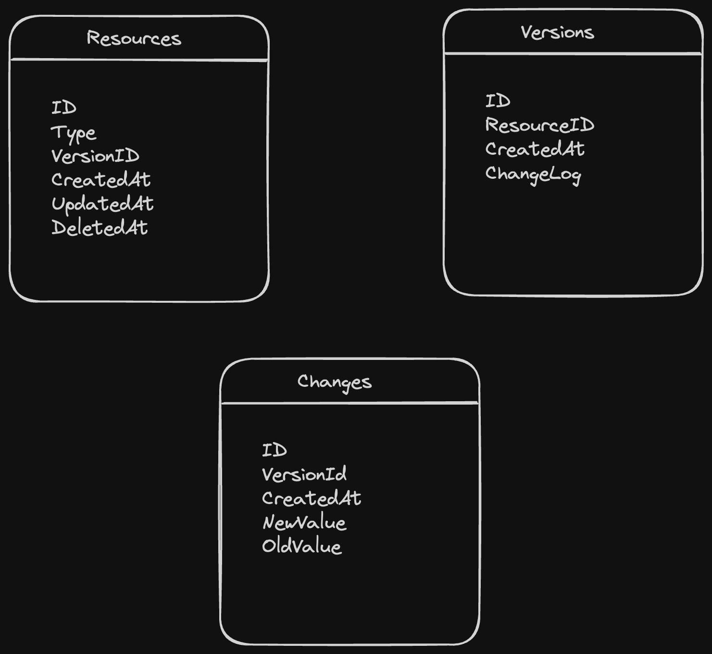

# saas-versioning

## API Design
The API acts as the interface through which users and systems interact with versioning service.

### Core API Endpoints:
#### Version Management

* POST /resources/{resourceId} to create a new version of a resource.
* GET /resources/{resourceId} to list versions of a resource.
* GET /resources/{resourceId}/versions/{versionId} to retrieve a specific version of a resource.

#### Search and Filter
* GET /search with query parameters for filtering and searching through versions based on criteria like type, dates, etc.

#### Comparison and Diff

* GET /resources/{resourceId}/compare?baseVersion={v1}&targetVersion={v2} to compare two versions of a resource.

### Database Design

#### Core Database Tables/Entities:
##### Resources
* Primary information about the resources being versioned.
* Columns: ResourceID, ResourceType, CurrentVersionID, CreatedAt, UpdatedAt, DeletedAt

##### Versions
* Stores each version of a resource.
* Columns: VersionID, ResourceID, CreatedAt, ChangeLog

##### Changes (if tracking detailed changes within versions)
* Stores detailed changes for each version. This can be normalized or denormalized depending on your needs.
* Columns: ChangeID, VersionID, OldValue, NewValue
