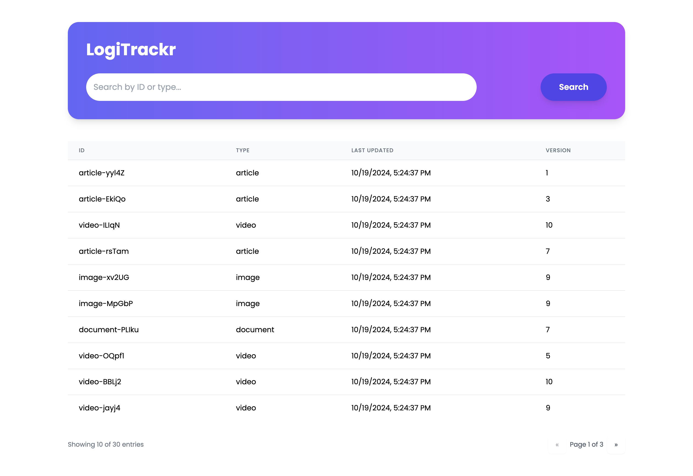
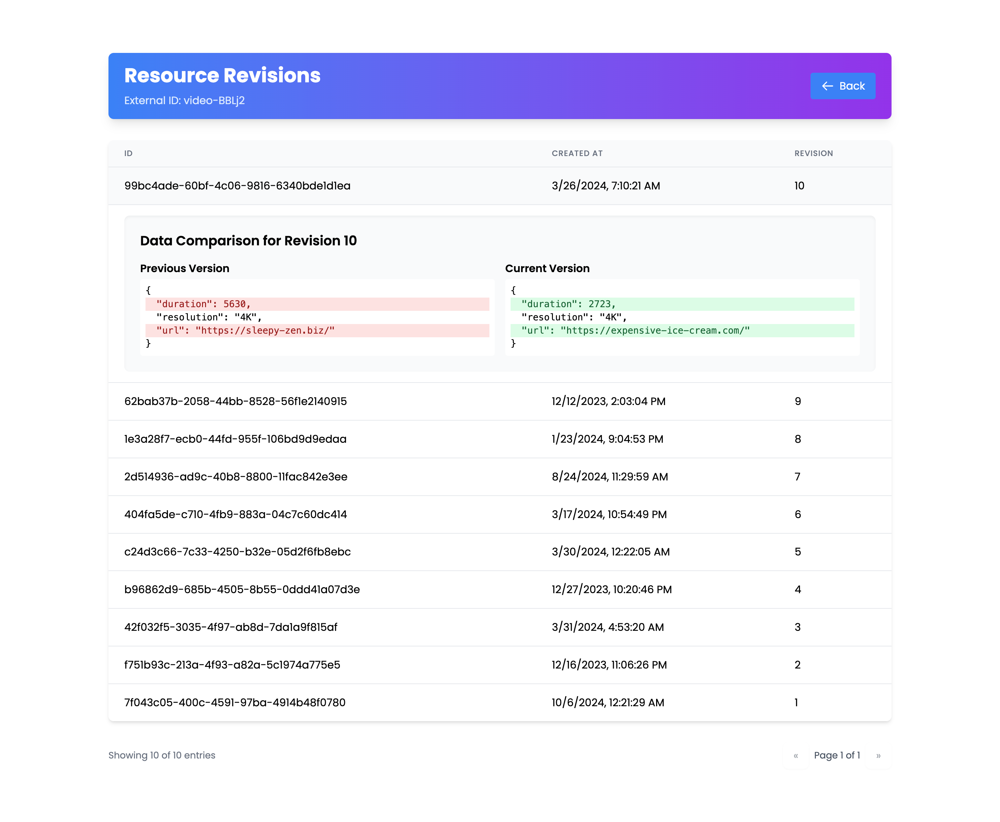

# Audit Log Application

<p align="center">
  
</p>

A powerful and flexible audit logging system for tracking changes and maintaining version history across your applications.

## Features

- 🔍 Comprehensive version tracking
- 🔄 Efficient diff and comparison tools
- 🔎 Search and filtering capabilities
- 🔐 Secure and scalable architecture
- 🚀 Easy integration with existing systems

## Interface

### Dashboard


### Version Comparison


## Development

To get started with development, follow these steps:

1. Clone the repository
2. Install dependencies:
   ```bash
   pnpm install
   ```
3. Set up the development database:
   ```bash
   make dev@db
   ```
4. Start the backend:
   ```bash
   make dev@backend
   ```
5. Start the frontend:
   ```bash
   make dev@ui
   ```

### Available Commands

Our `tools.mk` file provides several useful commands to manage the development environment:

- `make db@up`: Start the local database
- `make db@stop`: Stop the local database
- `make db@down`: Remove the local database
- `make db@logs`: Show logs from the local database
- `make db@generate`: Generate new migration file
- `make db@migrate`: Migrate database
- `make db@dashboard`: Open Drizzle-kit Studio
- `make db@seed`: Seed database
- `make dev@db`: Setup test database with migrations and seed data
- `make dev@backend`: Start the backend
- `make dev@ui`: Start the frontend

For a full list of available commands, run `make help`.

## Contributing

We welcome contributions from the community! If you encounter any issues or have suggestions for improvements, please feel free to open an issue or submit a pull request on our [GitHub repository](https://github.com/ikhvost/saas-versioning).

## License

This library is licensed under the [MIT License](https://opensource.org/licenses/MIT). See the [LICENSE](./LICENSE) file for more details.
